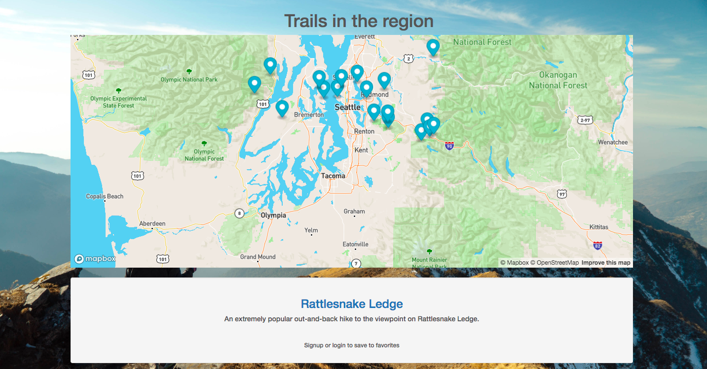
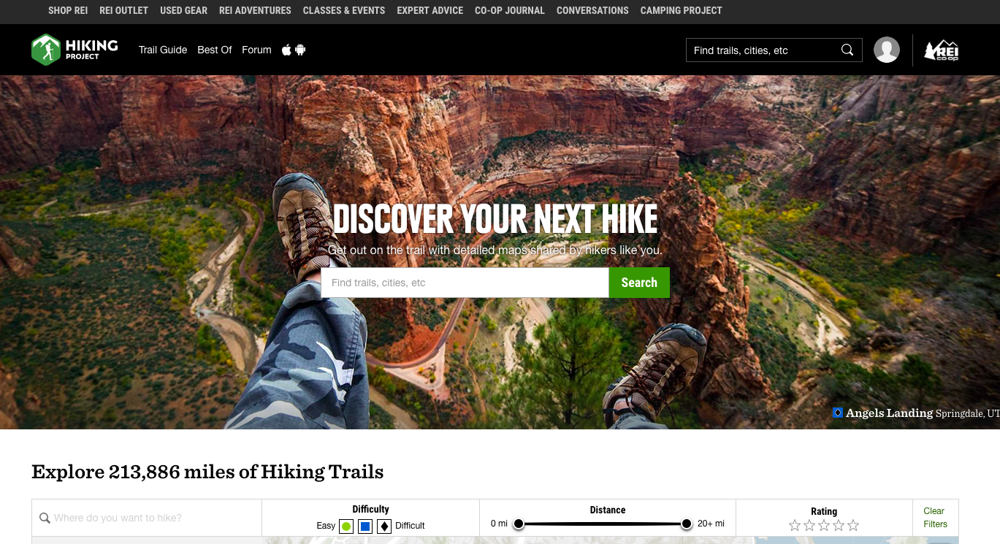
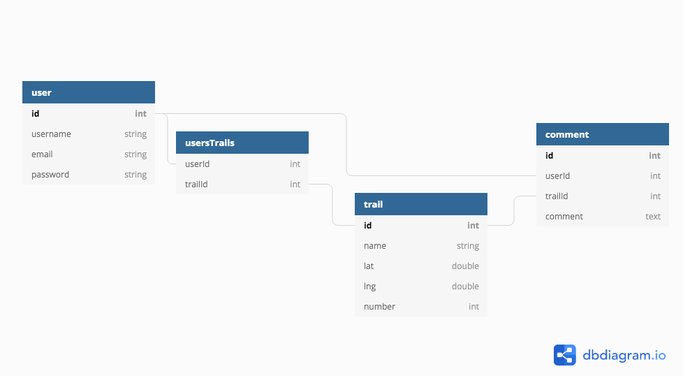
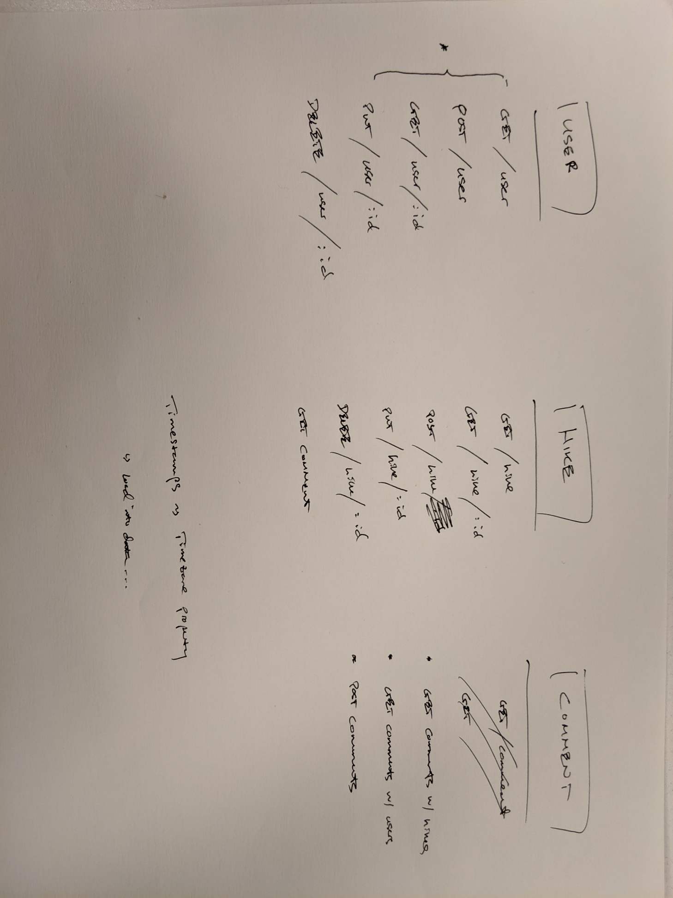

# Trail Blazer
## Nathan Chan | July 9, 2019
### General Assembly - Software Engineering Immersive Project 2: HTML, CSS/Bootstrap, Javascript, Node.js, Express,js, Postgres, Sequelize
#### Check out a demo of the site here: https://pure-reef-75179.herokuapp.com/

# Introduction
Looking for your next adventure? Here's where it begins! 
Use this site to search for your next hike! Search for your next hike, save them to your favorites, post reviews, and find similar hikes. 
Although there are similar sites available to the public, the existing sites provide an overwhelming amount of information at times which is difficult to understand and sort through. 

Screenshot of the app:

# Project Requirements
This is the second project that will be incorporated as part of the portfolio of the General Assembly Software Engineering Immersive. The goal is to combined all that we have learned in Units 1 and 2 (HTML, CSS, Javasript, Node.js, Express.js, Postgres, Sequelize, and Authentication) into a web application that we can publish for the public. 

## Technical Requirements
The technical requirements for the project are as follows: 

* Have at least 2 models (more if they make sense) -- ideally a user model and one that represents the main functional idea for your app
* Include sign up/log in functionality, with hashed passwords & an authorization flow
* Incorporate at least one API. Examples include Yelp, Tumblr, Facebook, and others on Mashape.
* Have complete RESTful routes for at least one of your resources with GET, POST, PUT, and DELETE
* Utilize an ORM to create a database table structure and interact with your relationally-stored data
* Include a readme file that explains how to use your app
* Have semantically clean HTML, CSS, and back-end code
* Be deployed online and accessible to the public

# NPM and APIs

Run npm install to install all of the dependencies

## Pulling from APIs

This project combines three APIs with an option to incorporate additional ones: 
1. Hiking Project API - https://www.hikingproject.com/data
2. Dark Sky API - https://darksky.net/dev/docs#overview
3. Mapbox API - https://docs.mapbox.com/api/search/

Images of the API sites

### Hiking Project API:

### Dark Sky API:

One challenge that I ran into with the Dark Sky API was the fact that it would only allow 1,000 API calls per day. I reached that limit because I was initially calling the API on each search which would return 20 trails each with their own Dark Sky API call. After this, I refactored the code to only show weather for the trail of choice 

### Mapbox API:

A challenge with Mapbox was the map itself was not being displayed properly as the map seemed to only show up on half of the space created for it. After doing some digging, I found that some of the CSS styling needed updating. 

# Planning
About 4-8 hours of the project was devoted to initial planning, database diagrams, and wireframing. 
Additionally another 8-12 hours was devoted to learning and setting up the authentication protocol. 

## Express Authentication

Express authentication template using Passport + flash messages + custom middleware. The authentication also includes hashing the password using bcrypt, sequelize validation for the password and username, and sequelize sessions for the login. 

## Database Design
After finding the appropriate data, the data connections were established to develop an app that meets the technical requirements of this project. 

Database Structure:

## Wireframing and User Exprience
Initial wireframes were drawn to understand the general flow of a user through the web app. The wireframing also helped to establish the initial routes and pages that would be referenced

### Route Files
The requirements of this project included implementing all four CRUD (Create, Read, Update, Delete) routes. The way this CRUD routes were constructed were initiall determined by the wireframing and user experience:

### Site Experience
The following are wireframe diagrams that best capture the initial thoughts for this web app. 

Description and Images of the site:

#### Home:

#### Profile / Signup:

#### Favorites:

#### Similar Results:

# Execution
The app itself provided a variety of different challenges ranging from setting up the models to route permissions to mutliple API calls to checking for similar trails and hikes. 

## Models 
The app itself used four different models
1. User Model
2. Trail Model 
3. Comment Model

The User and Trail models are linked via a many to many relationship through the usersTrails model and the User to Comment and Trail to Comment models are both one to many relationships. This allowed for each user to have access to a list of favorite trails and the ability to comment and edit his/her comment for each trail. 

## Route Permissions
The most challenging aspect of this project was deciding which routes and what kind of data would be available to a user who is logged in and one who is not. 

### Logged In
The main benefits of being logged in with a profile is that the user is able to save trails to their favorites and also leave comments for certain hikes. This means that the authentication had to be applied to all routes that included this functionality. 

### No account
Without an account, users could still search and view some details but they would not have the opportunity to save to favorites or comment. 

### The challenge
In the end the challenge was to lock the appropriate routes while showing the appropriate level of trail details depending on the user. 

## Async
Another feature that this project employed was the async module and functionality. This was due to the fact that there were mutliple API calls from different sources in one GET or Read route. This javascript module allows the user to pull the data from the API in the order that the designer determines and can render the data onto the page appropriately.  

## Checking for Similar Trails
The initial algorithm to check for similar trails looks at two criteria of a trail:
1. Length
2. Elevation Gain

On the page showing details for a single hike, there are two additional recommended hikes which are the closest to the selected hike in terms of the two criteria. 

This feature has additional potential to be developed into a more robust search and filter algorithm. 

# Built with
* HTML 
* CSS (including Bootstrap v4)
* Javascript
* Google Fonts
* Node.js
* Express.js
* Postgres
* Sequelize

# Credit To:
* alltrails.com for web content and layout inspiration
* hikingproject.com for web content and layout inspiration as well as icons
* Hiking Project API
* Dark Sky API
* Mapbox API
* Abe Yang for his initial investigation into the Dark Sky API

# Additional Collaborators:
Thanks to Steve Peters, Carlo Bruno, Mike Shull, and many others in the SEI-SEA-25 cohort for their ideas and thoughts that were incorporated in this project

# Additional Functionality and Wish List
* Incorporating pagination so that it would show only 10 results per page with a link to scroll to the next set of 10. 
* Adding in actual reviews by pulling from the Yelp API.
* Incorporating camping sites and fishing spots.
* Linking a trip to suggest good food places nearby.
* Showing numbers on the map that correspond to the hike/trail/
* Showing a map on each trail's show.ejs page.
* Implementing a more robust query to find similar hikes by certain attributes and criteria.